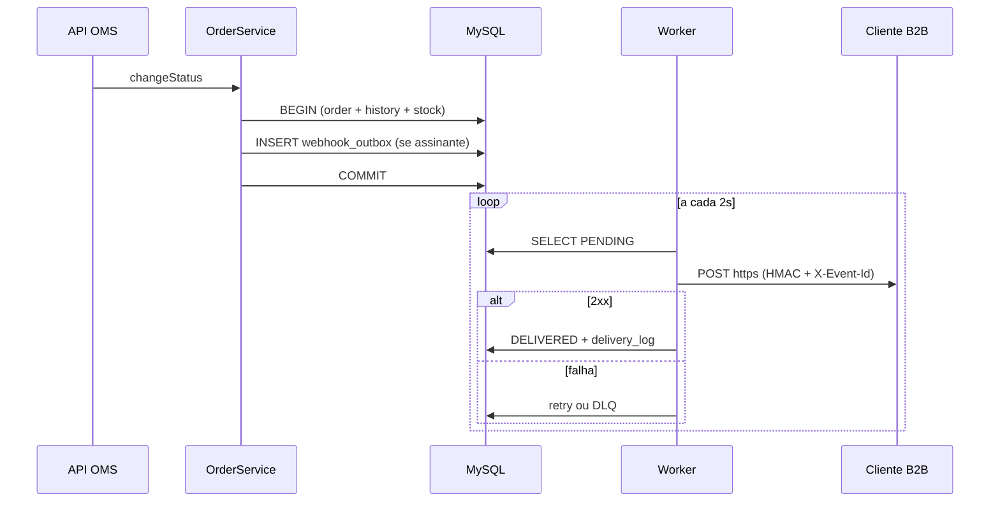

### FDD: Sistema de Webhooks de Notificação de Pedidos

Versão: 1.0  
Data: 07-11-2025  
Responsável: Bruno (Engenharia — Pedidos)

Referências: [RFC](./RFC.md) · [ADRs](./adrs/)

---

### 1. Contexto e motivação técnica

O OMS persiste mudanças de status de pedidos em transação (`changeStatus`): atualiza `orders`, insere `order_status_history` e ajusta estoque. Não existe hoje publicação de eventos nem integração outbound. Clientes B2B fazem polling em `GET /orders`, gerando carga e latência na integração.

A feature adiciona notificação **outbound** desacoplada: registro transacional na outbox (mesma transação do status) e entrega HTTP assíncrona por worker separado. Encaixa no [RFC](./RFC.md) e nos [ADRs](./adrs/): outbox ([ADR-001](./adrs/ADR-001-outbox-no-mysql.md)), worker ([ADR-002](./adrs/ADR-002-worker-polling-processo-separado.md)), retry/DLQ ([ADR-003](./adrs/ADR-003-retry-backoff-dlq.md)), HMAC ([ADR-004](./adrs/ADR-004-hmac-sha256-secret-por-endpoint.md)), at-least-once ([ADR-005](./adrs/ADR-005-at-least-once-x-event-id.md)), padrões do projeto ([ADR-006](./adrs/ADR-006-reuso-padroes-projeto.md)), snapshot ([ADR-007](./adrs/ADR-007-payload-snapshot-na-insercao.md)).

**Atores**

| Ator | Papel |
| --- | --- |
| API OMS | CRUD de webhooks, consulta de entregas, rotação de secret |
| `OrderService` | Publica evento na outbox dentro de `changeStatus` |
| Worker | Consome outbox, assina e entrega HTTP ao cliente |
| Cliente B2B | Recebe webhook, valida HMAC, deduplica por `X-Event-Id` |
| Operador ADMIN | Replay manual de dead letter |

**Restrições**

- Apenas URLs `https` no cadastro.
- Payload de evento máximo 64KB (erro se exceder, sem truncar).
- JWT de usuário do OMS na API de configuração; `customer_id` no body/path (não vem do JWT).

---

### 2. Objetivos técnicos

- **Latência de entrega:** evento disponível para envio em até **10 segundos** após commit do status (polling 2s + HTTP; SLA [09:02] Marcos).
- **Consistência:** se o status commitou, existe linha correspondente na outbox na mesma transação (invariante transacional).
- **Resiliência:** até **5 tentativas** com backoff 1m/5m/30m/2h/12h antes de dead letter.
- **Segurança:** 100% das entregas com HMAC-SHA256 e TLS; secret por endpoint.
- **Idempotência no consumidor:** 100% das entregas incluem `X-Event-Id` único (semântica at-least-once).
- **Compatibilidade:** módulo `webhooks` segue estrutura controller/service/repository/routes/schemas existente; erros com prefixo `WEBHOOK_`.

---

### 3. Escopo e exclusões

**Incluído**

- Tabelas: configuração de webhook, outbox, dead letter, log de entregas.
- Módulo `src/modules/webhooks/` (CRUD, schemas, processor).
- Entry-point `src/worker.ts` e script `npm run worker`.
- Integração em `OrderService.changeStatus` via `publishWebhookEvent(tx, ...)`.
- Endpoints autenticados de configuração e histórico de entregas.
- Endpoint ADMIN de replay de dead letter.
- Rotação de secret com grace period 24h.

**Excluído**

- Email de alerta ao cliente após falhas repetidas ([09:37] Larissa).
- Dashboard visual / painel frontend ([09:40] Larissa).
- Webhooks inbound (cliente → plataforma) ([09:02] Sofia).
- Arquivamento automático de outbox após 30 dias ([09:08] Diego).
- Rate limiting de saída por cliente (questão em aberto no [RFC](./RFC.md)).
- Multi-worker com ordering global ([09:13] Diego).

---

### 4. Fluxos detalhados e diagramas

#### 4.1 Fluxo principal: mudança de status → entrega

1. Cliente da API chama `PATCH /orders/:id/status` (fluxo existente).
2. `OrderService.changeStatus` inicia transação Prisma.
3. Valida transição (`order.status.ts`), estoque, atualiza pedido e histórico.
4. `publishWebhookEvent(tx, order, fromStatus, toStatus)`:
   - Busca webhooks ativos do `customer_id` que assinam `toStatus`.
   - Se nenhum assinante: retorna sem inserir ([09:34] Bruno).
   - Para cada webhook elegível: monta payload snapshot, gera `event_id` (UUID), insere em `webhook_outbox` com status `PENDING`.
5. Commit da transação.
6. Worker (loop 2s): seleciona batch de `PENDING` ordenado por `created_at`.
7. Para cada evento: marca `PROCESSING`, monta request HTTPS, calcula HMAC, envia headers.
8. Resposta 2xx em até 10s: marca `DELIVERED`, persiste log de entrega.
9. Falha ou timeout: incrementa tentativa, agenda `next_retry_at` conforme backoff ou move para DLQ após 5ª falha.



#### 4.2 Fluxo: retry com backoff

1. Entrega falha (timeout 10s, erro de rede ou status não-2xx).
2. Worker registra tentativa, `failure_reason` e calcula próximo slot: 1m → 5m → 30m → 2h → 12h.
3. Status volta a `PENDING` com `next_retry_at` futuro (worker ignora até o horário).
4. Após 5ª falha: copia para `webhook_dead_letter`, remove da outbox ativa.

#### 4.3 Fluxo: dead letter e replay

1. Operador ADMIN chama `POST /admin/webhooks/dead-letter/:id/replay`.
2. API valida `requireRole('ADMIN')`, loga `userId` e timestamp ([09:36] Sofia).
3. Recria linha na outbox como `PENDING` (mesmo `event_id` e payload snapshot).
4. Worker reprocessa; cliente deve deduplicar por `X-Event-Id` se já tiver recebido.

#### 4.4 Fluxo alternativo: rotação de secret

1. Cliente chama `POST /webhooks/:id/rotate-secret`.
2. API gera nova secret, mantém anterior válida por 24h ([09:21] Sofia).
3. Worker assina com secret ativa; durante grace, aceita verificação com qualquer uma das duas no lado do cliente.

#### 4.5 Estados do evento na outbox

```
PENDING → PROCESSING → DELIVERED
              ↓ (falha)
         PENDING (retry) → ... → DEAD_LETTER (após 5 falhas)
```

---

### 5. Contratos públicos (assinaturas, endpoints, headers, exemplos)

Formato de erro da API (padrão existente via `error.middleware.ts`):

```json
{
  "error": {
    "code": "WEBHOOK_NOT_FOUND",
    "message": "Webhook not found"
  }
}
```

#### Contrato 1: Criar webhook

- **Tipo:** endpoint
- **Rota:** `POST /api/webhooks`
- **Método:** POST
- **Auth:** Bearer JWT (qualquer role autenticada)
- **Semântica de status:**
  - `201` webhook criado; secret retornada **uma única vez** nesta resposta
  - `400` validação (URL não HTTPS, status inválido)
  - `401` não autenticado
  - `404` customer não encontrado

**Exemplo de requisição**

```json
{
  "customerId": "a1b2c3d4-e5f6-7890-abcd-ef1234567890",
  "url": "https://atlas.exemplo.com/webhooks/orders",
  "subscribedStatuses": ["SHIPPED", "DELIVERED"]
}
```

**Exemplo de resposta (201)**

```json
{
  "id": "f47ac10b-58cc-4372-a567-0e02b2c3d479",
  "customerId": "a1b2c3d4-e5f6-7890-abcd-ef1234567890",
  "url": "https://atlas.exemplo.com/webhooks/orders",
  "subscribedStatuses": ["SHIPPED", "DELIVERED"],
  "active": true,
  "secret": "whsec_8f3k2m9x1p4q7r0s6t2u5v8w1y4z7a0b",
  "createdAt": "2025-11-07T12:00:00.000Z"
}
```

#### Contrato 2: Listar webhooks do customer

- **Tipo:** endpoint
- **Rota:** `GET /api/webhooks?customerId={uuid}`
- **Método:** GET
- **Auth:** Bearer JWT
- **Semântica de status:**
  - `200` lista (secret **não** retornada)
  - `400` query inválida
  - `401` não autenticado

**Exemplo de resposta (200)**

```json
{
  "data": [
    {
      "id": "f47ac10b-58cc-4372-a567-0e02b2c3d479",
      "customerId": "a1b2c3d4-e5f6-7890-abcd-ef1234567890",
      "url": "https://atlas.exemplo.com/webhooks/orders",
      "subscribedStatuses": ["SHIPPED", "DELIVERED"],
      "active": true,
      "createdAt": "2025-11-07T12:00:00.000Z"
    }
  ]
}
```

#### Contrato 3: Histórico de entregas

- **Tipo:** endpoint
- **Rota:** `GET /api/webhooks/:id/deliveries`
- **Método:** GET
- **Auth:** Bearer JWT
- **Semântica:** últimos **100** registros ([09:34] Marcos); inclui sucesso/falha, payload, response, tempo de resposta

**Exemplo de resposta (200)**

```json
{
  "data": [
    {
      "id": "9b1deb4d-3b7d-4bad-9bdd-2b0d7b3dcb6d",
      "webhookId": "f47ac10b-58cc-4372-a567-0e02b2c3d479",
      "eventId": "3fa85f64-5717-4562-b3fc-2c963f66afa6",
      "success": true,
      "httpStatus": 200,
      "responseBody": "{\"ok\":true}",
      "durationMs": 142,
      "attemptNumber": 1,
      "deliveredAt": "2025-11-07T12:00:05.000Z"
    }
  ]
}
```

#### Contrato 4: Atualizar webhook

- **Tipo:** endpoint
- **Rota:** `PATCH /api/webhooks/:id`
- **Método:** PATCH
- **Auth:** Bearer JWT

**Exemplo de requisição**

```json
{
  "url": "https://atlas.exemplo.com/webhooks/orders-v2",
  "subscribedStatuses": ["PAID", "SHIPPED", "DELIVERED"],
  "active": true
}
```

**Exemplo de resposta (200)**

```json
{
  "id": "f47ac10b-58cc-4372-a567-0e02b2c3d479",
  "url": "https://atlas.exemplo.com/webhooks/orders-v2",
  "subscribedStatuses": ["PAID", "SHIPPED", "DELIVERED"],
  "active": true,
  "updatedAt": "2025-11-07T14:30:00.000Z"
}
```

#### Contrato 5: Replay de dead letter (ADMIN)

- **Tipo:** endpoint
- **Rota:** `POST /api/admin/webhooks/dead-letter/:id/replay`
- **Método:** POST
- **Auth:** Bearer JWT com role `ADMIN` ([09:36] Sofia)

**Exemplo de resposta (202)**

```json
{
  "deadLetterId": "7c9e6679-7425-40de-944b-e07fc1f90ae7",
  "outboxEventId": "2f9bda62-8c1e-4f7a-9b3d-5e6f7a8b9c0d",
  "status": "PENDING",
  "replayedBy": "admin-user-uuid",
  "replayedAt": "2025-11-07T15:00:00.000Z"
}
```

#### Contrato 6: Rotação de secret

- **Tipo:** endpoint
- **Rota:** `POST /api/webhooks/:id/rotate-secret`
- **Método:** POST
- **Auth:** Bearer JWT

**Exemplo de resposta (200)**

```json
{
  "webhookId": "f47ac10b-58cc-4372-a567-0e02b2c3d479",
  "newSecret": "whsec_n4w5x6y7z8a9b0c1d2e3f4g5h6i7j8k9",
  "previousSecretExpiresAt": "2025-11-08T15:00:00.000Z"
}
```

#### Contrato 7: Entrega outbound (worker → cliente)

- **Tipo:** endpoint (saída)
- **Método:** POST
- **URL:** configurada pelo cliente (`https` obrigatório)
- **Timeout:** 10 segundos ([09:42] Diego)

**Headers enviados**

| Header | Semântica |
| --- | --- |
| `Content-Type` | `application/json` |
| `X-Event-Id` | UUID único do evento; deduplicação no cliente |
| `X-Signature` | HMAC-SHA256 do corpo bruto (hex) |
| `X-Timestamp` | ISO 8601 do envio; anti-replay opcional no cliente |
| `X-Webhook-Id` | ID do endpoint cadastrado ([09:44] Sofia) |

**Exemplo de payload (corpo)**

```json
{
  "event_id": "3fa85f64-5717-4562-b3fc-2c963f66afa6",
  "event_type": "order.status_changed",
  "timestamp": "2025-11-07T12:00:03.123Z",
  "order_id": "550e8400-e29b-41d4-a716-446655440000",
  "order_number": "ORD-000042",
  "from_status": "PAID",
  "to_status": "PROCESSING",
  "customer_id": "a1b2c3d4-e5f6-7890-abcd-ef1234567890",
  "total_cents": 15000
}
```

Sem `items` no payload ([09:43] Diego). Cliente busca detalhes em `GET /orders/:id` se necessário.

#### Contrato interno: publicação na outbox

- **Tipo:** function
- **Assinatura:** `publishWebhookEvent(tx, order, fromStatus, toStatus)`
- **Contexto:** chamada dentro da transação de `changeStatus` ([09:41] Bruno)
- **Efeito:** insert condicional em `webhook_outbox`; rollback se falhar

---

### 6. Erros, exceções e fallback

#### Matriz de erros (`WEBHOOK_*`)

| Código | HTTP | Condição | Tratamento |
| --- | --- | --- | --- |
| `WEBHOOK_NOT_FOUND` | 404 | ID inexistente | `AppError` via middleware |
| `WEBHOOK_INVALID_URL` | 400 | URL não HTTPS ou malformada | Rejeição no schema Zod |
| `WEBHOOK_SECRET_REQUIRED` | 500 | Falha interna ao gerar secret | Log + erro genérico ao cliente |
| `WEBHOOK_PAYLOAD_TOO_LARGE` | 422 | Payload > 64KB na montagem | Não insere na outbox; falha transação se crítico |
| `WEBHOOK_INACTIVE` | 409 | Operação em webhook desativado | Mensagem clara ao chamador |
| `WEBHOOK_CUSTOMER_MISMATCH` | 403 | Webhook não pertence ao customer informado | Bloqueio de acesso |
| `WEBHOOK_DELIVERY_FAILED` | N/A (worker) | Falha HTTP outbound | Retry ou DLQ |
| `WEBHOOK_DEAD_LETTER_NOT_FOUND` | 404 | ID DLQ inexistente no replay | ADMIN recebe 404 |
| `WEBHOOK_REPLAY_FORBIDDEN` | 403 | Replay sem role ADMIN | `requireRole` |

Classes em `src/modules/webhooks/webhook.errors.ts` estendendo `AppError` / erros HTTP existentes ([09:28] Bruno).

#### Estratégias de resiliência

| Mecanismo | Parâmetro | Fonte |
| --- | --- | --- |
| Timeout HTTP outbound | 10s | [09:42] Diego |
| Tentativas | 5 | [09:16] Larissa |
| Backoff | 1m, 5m, 30m, 2h, 12h | [09:17] Diego |
| Fallback | Dead letter + replay manual ADMIN | [09:18] Diego |
| Circuit breaker | Não implementado na v1 | Hipótese: adiar (não discutido na reunião) |

#### Política de fallback

- Após esgotar retries: evento em `webhook_dead_letter`; **não** há envio alternativo (email/SMS).
- Replay manual recoloca na outbox; única recuperação automática é retry scheduleado.

#### Invariantes

1. Status de pedido commitado implica evento na outbox para cada webhook assinante do `toStatus`.
2. `event_id` imutável por linha de outbox; reenvios usam o mesmo `X-Event-Id`.
3. Secret nunca retornada após criação/rotação (exceto na resposta imediata).
4. Entregas só para URLs `https`.

---

### 7. Observabilidade

#### Métricas

| Métrica | Tipo | Descrição |
| --- | --- | --- |
| `webhook_outbox_pending_total` | gauge | Eventos aguardando processamento |
| `webhook_delivery_attempts_total` | counter | Tentativas por resultado (`success`, `failure`, `timeout`) |
| `webhook_delivery_duration_ms` | histogram | Latência HTTP outbound |
| `webhook_dlq_total` | gauge | Eventos em dead letter |
| `webhook_retry_scheduled_total` | counter | Retries agendados por faixa de backoff |

> **Nota:** nomes de métricas são proposta de implementação para validar SLAs do RFC; não foram enumerados na transcrição.

#### Logs

- **Biblioteca:** Pino (`src/shared/logger/index.ts`), mesmo padrão do projeto ([09:29] Bruno).
- **Campos estruturados:** `eventId`, `webhookId`, `orderId`, `customerId`, `attempt`, `httpStatus`, `durationMs`, `workerId`.
- **Redação:** secrets, `Authorization` e corpos com PII seguem `redact` existente.
- **Auditoria:** replay DLQ loga `replayedBy`, `deadLetterId`, `timestamp` ([09:36] Sofia).

#### Tracing

- Span `order.changeStatus` (existente ou estendido): inclui sub-span `webhook.publish_outbox`.
- Span `worker.process_batch` → `worker.deliver_webhook` com atributos `event_id`, `url` (host only), `attempt`.
- Amostragem: 100% em desenvolvimento; 10% em produção (hipótese operacional).

#### Dashboards e alertas mínimos

- Painel: outbox pending, taxa de falha, tamanho DLQ, p95 `delivery_duration_ms`.
- Alerta: `webhook_outbox_pending_total` crescente por > 15 min ou `webhook_dlq_total` acima de limiar acordado com operações.

---

### 8. Dependências e compatibilidade

| Componente | Versão mínima | Observações |
| --- | --- | --- |
| Node.js | mesma do projeto | Worker e API |
| MySQL | mesma do projeto | Outbox transacional |
| Prisma | 5.x (projeto) | `PrismaClient` separado no worker |
| Express | mesma do projeto | Rotas do módulo webhooks |
| Pino | mesma do projeto | Logs |
| `crypto` (Node) | built-in | HMAC-SHA256 |

**Garantias de compatibilidade**

- API de pedidos existente inalterada em contrato público; apenas extensão interna de `changeStatus`.
- Prefixo de rota `/api` via `buildApiRouter`; webhooks em `/api/webhooks` e `/api/admin/webhooks`.
- Erros JSON compatíveis com `error.middleware.ts`.
- Máquina de estados em `order.status.ts` define transições que geram eventos.

---

### 9. Critérios de aceite técnicos

- [ ] `changeStatus` insere na outbox na mesma transação; falha de insert faz rollback completo.
- [ ] Worker roda via `npm run worker`, processo separado da API.
- [ ] Polling 2s; evento entregue em < 10s em cenário nominal (cliente responde 200 em < 1s).
- [ ] HMAC-SHA256 verificável pelo cliente; URL `http` rejeitada no cadastro.
- [ ] `X-Event-Id` presente em toda entrega; reenvio mantém mesmo ID.
- [ ] Após 5 falhas, evento aparece em DLQ; replay ADMIN recria na outbox.
- [ ] `GET /webhooks/:id/deliveries` retorna até 100 registros.
- [ ] Rotação de secret: anterior válida 24h.
- [ ] Códigos de erro `WEBHOOK_*` retornados conforme matriz.
- [ ] Logs de replay incluem identificação do operador ADMIN.
- [ ] Testes de integração cobrem fluxo status → outbox → worker → mock cliente.

---

### 10. Riscos e mitigação

**Risco 1: Payload excede 64KB**

- Probabilidade: baixa
- Impacto: transação de status falha se tratado como erro crítico
- Mitigação:
  - Payload enxuto sem items ([09:43] Diego)
  - Validar tamanho antes do insert; erro `WEBHOOK_PAYLOAD_TOO_LARGE`
- Plano de contingência: revisar campos do snapshot se ocorrer em produção

**Risco 2: Cliente não deduplica `X-Event-Id`**

- Probabilidade: média
- Impacto: processamento duplicado de status no ERP do cliente
- Mitigação:
  - Documentação no portal ([09:26] Marcos)
  - Exemplo de idempotência no guia de integração
- Plano de contingência: suporte orienta implementação de dedup

**Risco 3: Acúmulo na outbox**

- Probabilidade: média
- Impacto: atraso acima do SLA de 10s
- Mitigação:
  - Índices em `status` e `created_at` ([09:08] Diego)
  - Métrica `webhook_outbox_pending_total` com alerta
- Plano de contingência: escalar batch do worker; avaliar segundo worker (questão em aberto)

**Risco 4: Vazamento de secret**

- Probabilidade: média
- Impacto: falsificação de webhooks
- Mitigação:
  - Secret por endpoint; rotação 24h; redaction no Pino
  - Revisão de segurança pré-deploy ([09:46] Sofia)
- Plano de contingência: rotacionar secret do endpoint afetado

---

### 11. Integração com o sistema existente

| Arquivo | Integração |
| --- | --- |
| `src/modules/orders/order.service.ts` | Em `changeStatus`, após atualizar pedido e histórico, chamar `publishWebhookEvent(tx, order, from, to)` dentro da mesma `$transaction`. Falha na publicação aborta a transação. |
| `src/modules/orders/order.status.ts` | Enum `OrderStatus` e `canTransition` definem quais transições existem; `subscribedStatuses` do webhook filtra quais `toStatus` geram evento. |
| `src/shared/errors/app-error.ts` | Novas classes `Webhook*Error` estendem `AppError` com `errorCode` prefixado `WEBHOOK_` ([09:28] Bruno). |
| `src/shared/errors/http-errors.ts` | Reutilizar `NotFoundError`, `ValidationError`, `ForbiddenError` como base; padrão de `errorCode` e `statusCode` alinhado a `InsufficientStockError`. |
| `src/middlewares/error.middleware.ts` | Sem alteração: serializa `AppError` em `{ error: { code, message, details? } }`. |
| `src/middlewares/auth.middleware.ts` | `authenticate` em rotas de webhook; `requireRole('ADMIN')` em replay DLQ ([09:36] Larissa). |
| `src/shared/logger/index.ts` | Worker e API usam `logger` com redaction; eventos de entrega e replay em nível `info`/`warn`. |
| `src/server.ts` | Referência de bootstrap para `src/worker.ts` (conexão DB, shutdown gracioso). |
| `src/routes/index.ts` | Registrar `buildWebhookRouter` em `/webhooks` e rotas admin em `/admin/webhooks`. |
| `prisma/schema.prisma` | Novos models: `Webhook`, `WebhookOutbox`, `WebhookDeadLetter`, `WebhookDelivery`; relação com `Customer` e `OrderStatus`. |

---

### Discrepâncias: prompt do curso vs rubrica do desafio

| Tópico | Prompt do curso | Rubrica do desafio | Resolução neste FDD |
| --- | --- | --- | --- |
| Seção integração código | Não listada no esqueleto (10 seções) | **Obrigatória** (≥4 arquivos) | Adicionada **seção 11** |
| Nome do arquivo | Esqueleto genérico | `docs/FDD.md` | Arquivo em `docs/FDD.md` |
| Entrevista passo a passo | Uma pergunta por vez | Não exigida | Gerado a partir de transcrição + RFC + ADRs |
| Export JSON | Oferecer ao final | Não exigido | Não incluído (disponível sob demanda) |
| Travessão "—" | Proibido no prompt | Silencioso | Evitado no texto |
| Circuit breaker | Listado como opção | Não discutido na reunião | Marcado como não implementado (hipótese) |
| Métricas/tracing | Exigir detalhe | Métricas, logs e tracing | Métricas/spans como proposta técnica; logs ancorados no Pino da transcrição |
