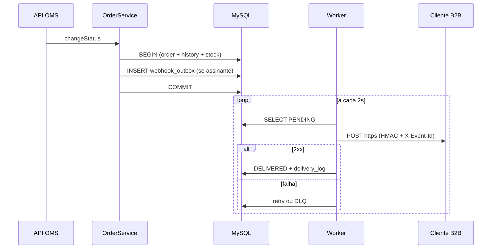

# FDD — Sistema de Webhooks de Notificação de Pedidos

Versão: 1.0  
Data: 07-11-2025  
Responsável: Bruno (Engenharia — Pedidos)

Referências: [RFC](./RFC.md) · [ADRs](./adrs/)

---

## Contexto e motivação técnica

O OMS persiste mudanças de status de pedidos em transação (`changeStatus`): atualiza `orders`, insere `order_status_history` e ajusta estoque. Não existe hoje publicação de eventos nem integração outbound. Clientes B2B fazem polling em `GET /orders`, gerando carga e latência na integração.

A feature adiciona notificação **outbound** desacoplada: registro transacional na outbox (mesma transação do status) e entrega HTTP assíncrona por worker separado. A solução implementa as decisões do [RFC](./RFC.md) e dos [ADRs](./adrs/): outbox ([ADR-001](./adrs/ADR-001-outbox-no-mysql.md)), worker ([ADR-002](./adrs/ADR-002-worker-polling-processo-separado.md)), retry/DLQ ([ADR-003](./adrs/ADR-003-retry-backoff-dlq.md)), HMAC ([ADR-004](./adrs/ADR-004-hmac-sha256-secret-por-endpoint.md)), at-least-once ([ADR-005](./adrs/ADR-005-at-least-once-x-event-id.md)), padrões do projeto ([ADR-006](./adrs/ADR-006-reuso-padroes-projeto.md)), snapshot ([ADR-007](./adrs/ADR-007-payload-snapshot-na-insercao.md)).

**Atores**

| Ator | Papel |
| --- | --- |
| API OMS | CRUD de webhooks, consulta de entregas, rotação de secret |
| `OrderService` | Publica evento na outbox dentro de `changeStatus` |
| Worker | Consome outbox, assina e entrega HTTP ao cliente |
| Cliente B2B | Recebe webhook, valida HMAC, deduplica por `X-Event-Id` |
| Operador ADMIN | Replay manual de dead letter |

**Restrições**

- Apenas URLs `https` no cadastro.
- Payload de evento máximo 64KB (erro se exceder, sem truncar).
- JWT de usuário do OMS na API de configuração; `customer_id` no body/path (não vem do JWT).

---

## Objetivos técnicos

- **Latência de entrega:** evento disponível para envio em até **10 segundos** após commit do status (polling 2s + HTTP).
- **Consistência:** se o status commitou, existe linha correspondente na outbox na mesma transação.
- **Resiliência:** até **5 tentativas** com backoff 1m/5m/30m/2h/12h antes de dead letter.
- **Segurança:** 100% das entregas com HMAC-SHA256 e TLS; secret por endpoint.
- **Idempotência no consumidor:** 100% das entregas incluem `X-Event-Id` único (semântica at-least-once).
- **Compatibilidade:** módulo `webhooks` segue estrutura controller/service/repository/routes/schemas existente; erros com prefixo `WEBHOOK_`.

---

## Escopo e exclusões

**Incluído**

- Tabelas: configuração de webhook, outbox, dead letter, log de entregas.
- Módulo `src/modules/webhooks/` (CRUD, schemas, processor).
- Entry-point `src/worker.ts` e script `npm run worker`.
- Integração em `OrderService.changeStatus` via `publishWebhookEvent(tx, ...)`.
- Endpoints autenticados de configuração e histórico de entregas.
- Endpoint ADMIN de replay de dead letter.
- Rotação de secret com grace period de 24h.

**Excluído**

- Email de alerta ao cliente após falhas repetidas.
- Dashboard visual / painel frontend.
- Webhooks inbound (cliente para plataforma).
- Arquivamento automático de outbox após 30 dias.
- Rate limiting de saída por cliente (adiado; ver [RFC](./RFC.md)).
- Multi-worker com ordering global (adiado; ver [RFC](./RFC.md)).

---

## Fluxos detalhados

### Criação do evento na outbox

1. Cliente da API chama `PATCH /orders/:id/status` (fluxo existente).
2. `OrderService.changeStatus` inicia transação Prisma.
3. Valida transição (`order.status.ts`), estoque, atualiza pedido e histórico.
4. `publishWebhookEvent(tx, order, fromStatus, toStatus)`:
   - Busca webhooks ativos do `customer_id` que assinam `toStatus`.
   - Se nenhum assinante: retorna sem inserir.
   - Para cada webhook elegível: monta payload snapshot, gera `event_id` (UUID), insere em `webhook_outbox` com status `PENDING`.
5. Commit da transação (falha na outbox faz rollback completo).

### Processamento pelo worker

1. Worker em loop de 2s seleciona batch de `PENDING` ordenado por `created_at`.
2. Para cada evento: marca `PROCESSING`, monta request HTTPS, calcula HMAC-SHA256, envia headers.
3. Resposta 2xx em até 10s: marca `DELIVERED`, persiste log de entrega.
4. Falha ou timeout: aciona fluxo de retry.



### Retry

1. Entrega falha (timeout 10s, erro de rede ou status não-2xx).
2. Worker registra tentativa, `failure_reason` e calcula próximo slot: 1m, 5m, 30m, 2h, 12h.
3. Status volta a `PENDING` com `next_retry_at` futuro.
4. Após 5ª falha: segue para DLQ.

### DLQ e replay

1. Evento copiado para `webhook_dead_letter`; removido da outbox ativa.
2. Operador ADMIN chama `POST /api/admin/webhooks/dead-letter/:id/replay`.
3. API valida `requireRole('ADMIN')`, loga `userId` e timestamp.
4. Recria linha na outbox como `PENDING` (mesmo `event_id` e payload snapshot).
5. Worker reprocessa; cliente deduplica por `X-Event-Id` se necessário.

### Rotação de secret

1. Cliente chama `POST /api/webhooks/:id/rotate-secret`.
2. API gera nova secret; anterior válida por 24h.
3. Worker assina com secret ativa.

### Estados do evento na outbox

```
PENDING → PROCESSING → DELIVERED
              ↓ (falha)
         PENDING (retry) → ... → DEAD_LETTER (após 5 falhas)
```

---

## Contratos públicos

Formato de erro da API (padrão existente via `error.middleware.ts`):

```json
{
  "error": {
    "code": "WEBHOOK_NOT_FOUND",
    "message": "Webhook not found"
  }
}
```

### POST /api/webhooks — Criar webhook

- **Auth:** Bearer JWT (qualquer role autenticada)
- **Status:** `201` criado (secret retornada uma única vez) · `400` validação · `401` não autenticado · `404` customer não encontrado

**Request**

```json
{
  "customerId": "a1b2c3d4-e5f6-7890-abcd-ef1234567890",
  "url": "https://atlas.exemplo.com/webhooks/orders",
  "subscribedStatuses": ["SHIPPED", "DELIVERED"]
}
```

**Response (201)**

```json
{
  "id": "f47ac10b-58cc-4372-a567-0e02b2c3d479",
  "customerId": "a1b2c3d4-e5f6-7890-abcd-ef1234567890",
  "url": "https://atlas.exemplo.com/webhooks/orders",
  "subscribedStatuses": ["SHIPPED", "DELIVERED"],
  "active": true,
  "secret": "whsec_8f3k2m9x1p4q7r0s6t2u5v8w1y4z7a0b",
  "createdAt": "2025-11-07T12:00:00.000Z"
}
```

### GET /api/webhooks?customerId={uuid} — Listar webhooks

- **Auth:** Bearer JWT
- **Status:** `200` lista (sem secret) · `400` query inválida · `401` não autenticado

**Request**

Query string obrigatória:

```
GET /api/webhooks?customerId=a1b2c3d4-e5f6-7890-abcd-ef1234567890
```

**Response (200)**

```json
{
  "data": [
    {
      "id": "f47ac10b-58cc-4372-a567-0e02b2c3d479",
      "customerId": "a1b2c3d4-e5f6-7890-abcd-ef1234567890",
      "url": "https://atlas.exemplo.com/webhooks/orders",
      "subscribedStatuses": ["SHIPPED", "DELIVERED"],
      "active": true,
      "createdAt": "2025-11-07T12:00:00.000Z"
    }
  ]
}
```

### GET /api/webhooks/:id/deliveries — Histórico de entregas

- **Auth:** Bearer JWT
- **Status:** `200` últimos 100 registros · `404` webhook não encontrado
- **Semântica:** sucesso/falha, payload, response, tempo de resposta

**Request**

Path param obrigatório:

```
GET /api/webhooks/f47ac10b-58cc-4372-a567-0e02b2c3d479/deliveries
```

**Response (200)**

```json
{
  "data": [
    {
      "id": "9b1deb4d-3b7d-4bad-9bdd-2b0d7b3dcb6d",
      "webhookId": "f47ac10b-58cc-4372-a567-0e02b2c3d479",
      "eventId": "3fa85f64-5717-4562-b3fc-2c963f66afa6",
      "success": true,
      "httpStatus": 200,
      "responseBody": "{\"ok\":true}",
      "durationMs": 142,
      "attemptNumber": 1,
      "deliveredAt": "2025-11-07T12:00:05.000Z"
    }
  ]
}
```

### PATCH /api/webhooks/:id — Atualizar webhook

- **Auth:** Bearer JWT
- **Status:** `200` atualizado · `400` validação · `404` não encontrado

**Request**

```json
{
  "url": "https://atlas.exemplo.com/webhooks/orders-v2",
  "subscribedStatuses": ["PAID", "SHIPPED", "DELIVERED"],
  "active": true
}
```

**Response (200)**

```json
{
  "id": "f47ac10b-58cc-4372-a567-0e02b2c3d479",
  "url": "https://atlas.exemplo.com/webhooks/orders-v2",
  "subscribedStatuses": ["PAID", "SHIPPED", "DELIVERED"],
  "active": true,
  "updatedAt": "2025-11-07T14:30:00.000Z"
}
```

### DELETE /api/webhooks/:id — Remover webhook

- **Auth:** Bearer JWT
- **Status:** `204` removido · `404` não encontrado · `409` entregas pendentes (opcional — política a definir na implementação)

**Request**

Sem corpo. Identificador do webhook no path (`:id`).

**Response (204)**

Sem corpo.

### POST /api/admin/webhooks/dead-letter/:id/replay — Replay DLQ

- **Auth:** Bearer JWT com role `ADMIN`
- **Status:** `202` aceito · `403` sem permissão · `404` DLQ não encontrada

**Response (202)**

```json
{
  "deadLetterId": "7c9e6679-7425-40de-944b-e07fc1f90ae7",
  "outboxEventId": "2f9bda62-8c1e-4f7a-9b3d-5e6f7a8b9c0d",
  "status": "PENDING",
  "replayedBy": "admin-user-uuid",
  "replayedAt": "2025-11-07T15:00:00.000Z"
}
```

### POST /api/webhooks/:id/rotate-secret — Rotação de secret

- **Auth:** Bearer JWT
- **Status:** `200` nova secret (grace 24h na anterior) · `404` não encontrado

**Response (200)**

```json
{
  "webhookId": "f47ac10b-58cc-4372-a567-0e02b2c3d479",
  "newSecret": "whsec_n4w5x6y7z8a9b0c1d2e3f4g5h6i7j8k9",
  "previousSecretExpiresAt": "2025-11-08T15:00:00.000Z"
}
```

### Entrega outbound (worker para cliente)

- **Método:** POST na URL configurada (`https` obrigatório)
- **Timeout:** 10 segundos

**Headers**

| Header | Semântica |
| --- | --- |
| `Content-Type` | `application/json` |
| `X-Event-Id` | UUID único; deduplicação no cliente |
| `X-Signature` | HMAC-SHA256 do corpo bruto (hex) |
| `X-Timestamp` | ISO 8601 do envio |
| `X-Webhook-Id` | ID do endpoint cadastrado |

**Payload**

```json
{
  "event_id": "3fa85f64-5717-4562-b3fc-2c963f66afa6",
  "event_type": "order.status_changed",
  "timestamp": "2025-11-07T12:00:03.123Z",
  "order_id": "550e8400-e29b-41d4-a716-446655440000",
  "order_number": "ORD-000042",
  "from_status": "PAID",
  "to_status": "PROCESSING",
  "customer_id": "a1b2c3d4-e5f6-7890-abcd-ef1234567890",
  "total_cents": 15000
}
```

Sem `items` no payload. Cliente consulta `GET /orders/:id` para detalhes complementares.

### Função interna: publishWebhookEvent

- **Assinatura:** `publishWebhookEvent(tx, order, fromStatus, toStatus)`
- **Contexto:** dentro da transação de `changeStatus`
- **Efeito:** insert condicional em `webhook_outbox`; rollback se falhar

---

## Matriz de erros previstos

| Código | HTTP | Condição | Tratamento |
| --- | --- | --- | --- |
| `WEBHOOK_NOT_FOUND` | 404 | ID inexistente | `AppError` via middleware |
| `WEBHOOK_INVALID_URL` | 400 | URL não HTTPS ou malformada | Validação Zod |
| `WEBHOOK_SECRET_REQUIRED` | 500 | Falha ao gerar secret | Log + erro ao cliente |
| `WEBHOOK_PAYLOAD_TOO_LARGE` | 422 | Payload > 64KB | Rejeição na montagem do evento |
| `WEBHOOK_INACTIVE` | 409 | Webhook desativado | Erro ao chamador |
| `WEBHOOK_CUSTOMER_MISMATCH` | 403 | Webhook de outro customer | Bloqueio de acesso |
| `WEBHOOK_DELIVERY_FAILED` | N/A | Falha HTTP outbound (worker) | Retry ou DLQ |
| `WEBHOOK_DEAD_LETTER_NOT_FOUND` | 404 | ID DLQ inexistente no replay | Erro ao ADMIN |
| `WEBHOOK_REPLAY_FORBIDDEN` | 403 | Replay sem role ADMIN | `requireRole` |

Classes em `src/modules/webhooks/webhook.errors.ts` estendendo `AppError` e erros HTTP existentes.

---

## Estratégias de resiliência

| Mecanismo | Configuração |
| --- | --- |
| **Timeout** | 10s por chamada HTTP outbound |
| **Retries** | 5 tentativas por evento |
| **Backoff** | 1 min, 5 min, 30 min, 2 h, 12 h entre tentativas |
| **Fallback** | Dead letter após esgotar retries; replay manual por ADMIN |

**Política de fallback:** não há canal alternativo (email/SMS). Recuperação automática limitada ao retry scheduleado; DLQ exige replay ADMIN.

**Invariantes**

1. Status commitado implica evento na outbox para cada webhook assinante do `toStatus`.
2. `event_id` imutável; reenvios usam o mesmo `X-Event-Id`.
3. Secret não retornada após criação/rotação (exceto resposta imediata).
4. Entregas apenas para URLs `https`.

---

## Observabilidade

### Métricas

| Métrica | Tipo | Uso |
| --- | --- | --- |
| `webhook_outbox_pending_total` | gauge | Fila de eventos pendentes |
| `webhook_delivery_attempts_total` | counter | Tentativas por resultado (`success`, `failure`, `timeout`) |
| `webhook_delivery_duration_ms` | histogram | Latência HTTP outbound (validar SLA < 10s) |
| `webhook_dlq_total` | gauge | Volume em dead letter |
| `webhook_retry_scheduled_total` | counter | Retries por faixa de backoff |

### Logs

- **Biblioteca:** Pino (`src/shared/logger/index.ts`), padrão do projeto.
- **Campos:** `eventId`, `webhookId`, `orderId`, `customerId`, `attempt`, `httpStatus`, `durationMs`, `workerId`.
- **Redação:** secrets e `Authorization` via `redact` existente.
- **Auditoria:** replay DLQ registra `replayedBy`, `deadLetterId`, `timestamp`.

### Tracing

- Span `order.changeStatus` com sub-span `webhook.publish_outbox`.
- Span `worker.process_batch` e `worker.deliver_webhook` com `event_id`, host da URL e `attempt`.
- Correlação entre API e worker via `event_id`.

### Alertas mínimos

- `webhook_outbox_pending_total` crescente por mais de 15 minutos.
- `webhook_dlq_total` acima de limiar operacional.
- p95 de `webhook_delivery_duration_ms` próximo ao SLA de 10s.

---

## Dependências e compatibilidade

| Componente | Versão | Observações |
| --- | --- | --- |
| Node.js | mesma do projeto | API e worker |
| MySQL | mesma do projeto | Outbox transacional |
| Prisma | 5.x | `PrismaClient` separado no worker |
| Express | mesma do projeto | Rotas do módulo |
| Pino | mesma do projeto | Logs estruturados |
| `crypto` (Node) | built-in | HMAC-SHA256 |

**Compatibilidade**

- Contrato público de pedidos inalterado; extensão interna em `changeStatus`.
- Rotas em `/api/webhooks` e `/api/admin/webhooks` via `buildApiRouter`.
- Erros JSON no formato `{ error: { code, message, details? } }`.
- Transições em `order.status.ts` definem eventos elegíveis.

---

## Critérios de aceite técnicos

- [ ] `changeStatus` insere na outbox na mesma transação; falha faz rollback completo.
- [ ] Worker via `npm run worker`, processo separado da API.
- [ ] Polling 2s; entrega em menos de 10s em cenário nominal.
- [ ] HMAC-SHA256 verificável; URL `http` rejeitada no cadastro.
- [ ] `X-Event-Id` em toda entrega; reenvio mantém mesmo ID.
- [ ] Após 5 falhas, evento na DLQ; replay ADMIN recria na outbox.
- [ ] `GET /webhooks/:id/deliveries` retorna até 100 registros.
- [ ] Rotação de secret com grace de 24h na anterior.
- [ ] Códigos `WEBHOOK_*` conforme matriz de erros.
- [ ] Logs de replay identificam operador ADMIN.
- [ ] Testes de integração: status → outbox → worker → mock cliente.

---

## Riscos e mitigação

**Payload excede 64KB**

- Probabilidade: baixa · Impacto: falha na publicação do evento
- Mitigação: payload enxuto sem items; validação pré-insert com `WEBHOOK_PAYLOAD_TOO_LARGE`
- Contingência: revisar campos do snapshot se ocorrer em produção

**Cliente não deduplica `X-Event-Id`**

- Probabilidade: média · Impacto: processamento duplicado no ERP do cliente
- Mitigação: documentação no portal; exemplos de idempotência
- Contingência: suporte orienta implementação de dedup

**Acúmulo na outbox**

- Probabilidade: média · Impacto: atraso acima do SLA de 10s
- Mitigação: índices em `status` e `created_at`; alerta em `webhook_outbox_pending_total`
- Contingência: aumentar batch do worker; avaliar segundo worker (RFC)

**Vazamento de secret**

- Probabilidade: média · Impacto: falsificação de webhooks
- Mitigação: secret por endpoint; rotação 24h; redaction no Pino; revisão de segurança pré-deploy
- Contingência: rotacionar secret do endpoint afetado

---

## Integração com o sistema existente

| Arquivo | Integração |
| --- | --- |
| `src/modules/orders/order.service.ts` | Em `changeStatus`, após atualizar pedido e histórico, chamar `publishWebhookEvent(tx, order, from, to)` na mesma `$transaction`. Falha aborta a transação. |
| `src/modules/orders/order.status.ts` | `OrderStatus` e `canTransition` definem transições válidas; `subscribedStatuses` filtra quais `toStatus` geram evento. |
| `src/shared/errors/app-error.ts` | Classes `Webhook*Error` estendem `AppError` com `errorCode` prefixado `WEBHOOK_`. |
| `src/shared/errors/http-errors.ts` | Reutilizar padrão de `NotFoundError`, `ValidationError`, `ForbiddenError` como em `InsufficientStockError`. |
| `src/middlewares/error.middleware.ts` | Sem alteração: serializa `AppError` em JSON padronizado. |
| `src/middlewares/auth.middleware.ts` | `authenticate` nas rotas de webhook; `requireRole('ADMIN')` no replay DLQ. |
| `src/shared/logger/index.ts` | Logger Pino com redaction; logs de entrega e replay. |
| `src/server.ts` | Referência de bootstrap para `src/worker.ts`. |
| `src/routes/index.ts` | Registrar `buildWebhookRouter` em `/webhooks` e admin em `/admin/webhooks`. |
| `prisma/schema.prisma` | Models `Webhook`, `WebhookOutbox`, `WebhookDeadLetter`, `WebhookDelivery`. |
